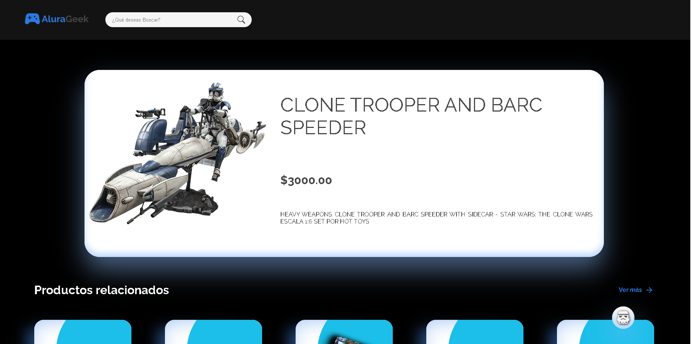
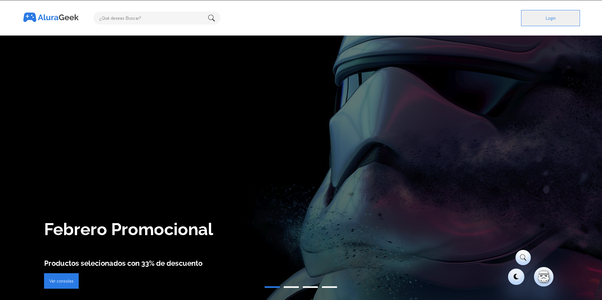
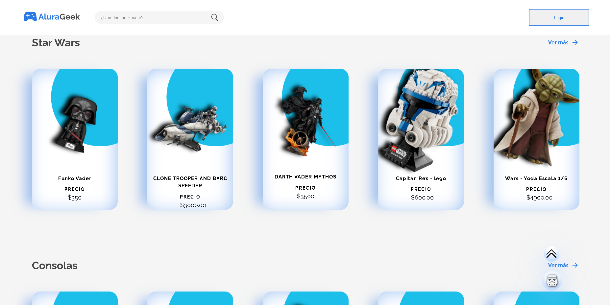
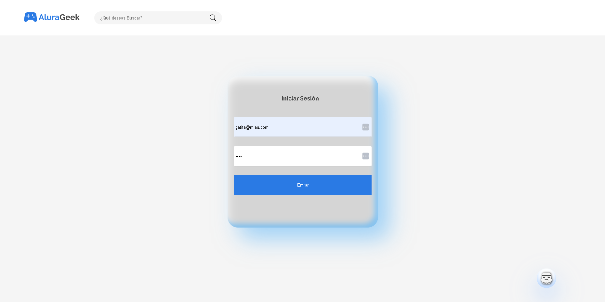
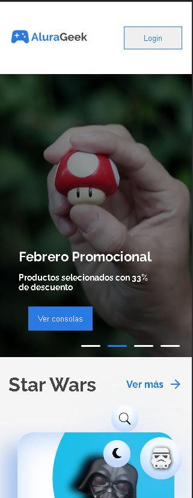
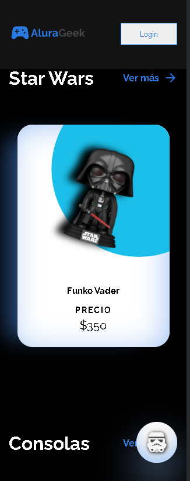

# Proyecto de desafío frontend de AluraGeek

Este es mi proyecto para el desafío Frontend propuesto por Oracle Next Education y Alura LATAM.

## Descripción del desafío

El desafío consiste en crear una tienda en línea basada en el [archivo figma](https://www.figma.com/design/eSIemWMmHT750XP4D810yz/AluraGeek---new) proporcionado. Si bien se espera que sigamos el diseño del archivo FIGMA, también tenemos la libertad de personalizarlo a nuestro gusto.

Uno de los requisitos clave es implementar operaciones CRUD (Crear, Leer, Actualizar, Eliminar) mediante solicitudes HTTP. Esto significa que deberíamos poder administrar y manipular productos dentro de nuestra tienda, incluida su lectura, creación, eliminación y edición.


## Tecnologias Usadas

El proyecto se construye usando JavaScript y utiliza JSON Server para simular la API para la gestión de productos.


## Empezando


### 1. Clona este repositorio en tu máquina local.

   ```bash
   git clone https://github.com/carolaresch2203/AluraGeek
   ```

### 2. Explore the project and make customizations as needed for your own projects.

## Important 🦉

If you want to interact with the API you will need to switch de URL from vercel, to a FAKE API with json-server. 

first you need to install json server:

```bash
npm install -g json-server
```

### 3 - Use the db.json File
You need to use the ```db.json``` ALREADY created, that will act as the data source.  

### 4 - Start the Server

### Start up the JSON 

Server by typing this command into your terminal: ```json-server --watch db.json.``` This will run on "https://localhost:3000" by default. You can change the port it's running on by specifying a different port number when starting the server using the --port flag.

### JSON Server will automatically generate RESTful endpoints based on the data you defined in your JSON file.

If you have a JSON file with an array of "users", this is the endpoint that will be automatically generated by the JSON Server:

- GET  /users - This retrieves a list of all resource entities of users.

- GET /users/:id - This retrieves a specific user by its id.

- POST /users - This creates a new user.

- PUT /users/:id - This updates a user based on a specified id.

- DELETE /users/:id - This deletes a user based on the specified id.

This pattern makes it easy to interact with the mock API in a RESTful manner just like one would do with a real backend API.

4 - Replace the VERCEL fake API, for this new resourse that you create with the ```json-server --watch db.json.``` command. It should look like this:


Now you are able to make petitions to htttp. 


## Contributing

If you'd like to contribute to this project or report issues, please feel free to submit a pull request or open an issue on this repository. We welcome contributions and feedback from the community.

## Acknowledgments

Don't forget to give this repository a star ⭐ if you find it useful!








